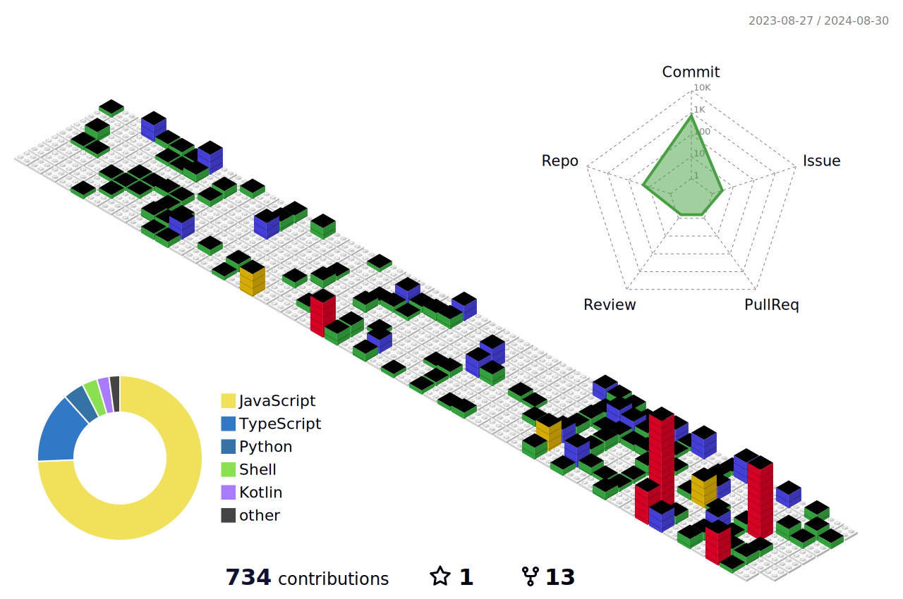

### 🙋🏻‍♂️ Hi, I'm Vishesh Jain.
I'd love to share a bit about myself:
 - Associate Solution Leader Trainee at Brane Enterprises, focused on JUnit testing and clean code practices.
 - Developed the Student Mentorship Programme Portal at IIIT-Delhi, used by 700+ mentees and 100+ mentors.
 - Created "The Tapper" sensory game and "Raah" Android app to support child development.
 - Interned at Jio Platforms, working on a data pipeline and secure encryption techniques.

here's how I am an asset:
 - Strong skills in Android development with Java, Kotlin, and Android Studio.
 - Proficient in building scalable web apps with React.js and CSS.
 - Detail-oriented with a focus on ensuring high code quality.
 - Experienced in backend development with Spring Boot and REST APIs.
 - Quick learner, ready to tackle any software development challenge.

### My Tools 🛠

### My Skills 🦇

